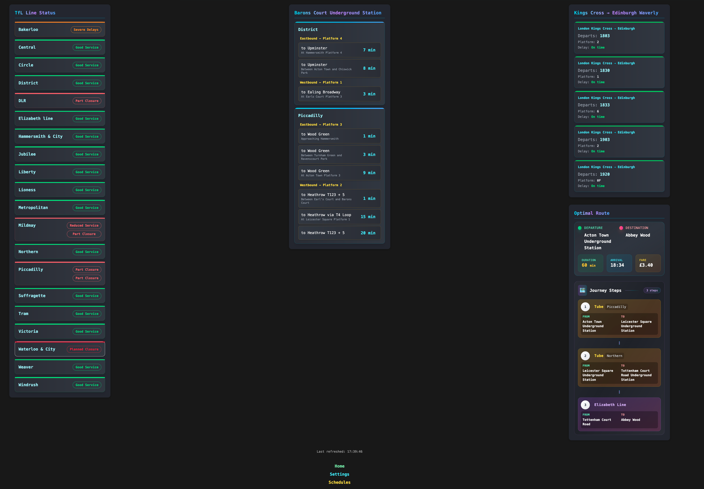
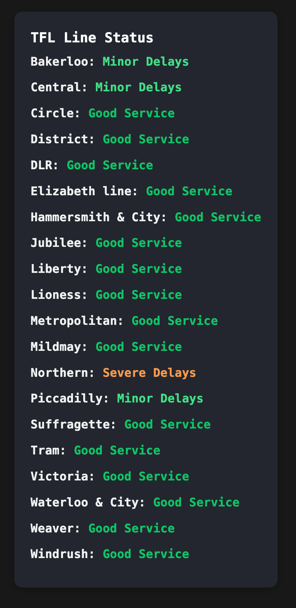

# Travel Dashboard

A comprehensive full-stack application for live train and tube status, route planning, and arrivals, built with Next.js (frontend), FastAPI (backend), and a Python push server for notifications and background jobs.

---





## Overview

A modern, type-safe travel dashboard providing real-time transport information across London's rail and tube networks.

- **Frontend (`app/`):** Next.js 16, React 19, TypeScript, Tailwind CSS 4. Component-based architecture with generic reusable components, comprehensive test coverage, and responsive design. Features live arrivals, route planning, and configuration management.

- **Backend (`api/`):** FastAPI with Python 3.14+. Clean architecture with domain-driven design, comprehensive type annotations, and extensive test coverage. Handles live TfL arrivals with platform name transformations, rail departures, route planning with fare integration, and dynamic configuration.

- **Push Server (`push/`):** Background service for notifications, scheduled updates, and automated alerts. Includes job scheduling, notification handling via ntfy, data formatters, and external API fetchers.

## Setup

See [SETUP.md](./SETUP.md) for detailed installation and configuration instructions.

## Project Structure

### Backend Structure Highlights

Clean architecture with comprehensive type safety and domain-driven design:

```
- `src/adapters/` - External API clients and HTTP routers
- `src/application/` - Service layer with dependency injection
- `src/domain/` - Business logic and models with type annotations
  - `rail/` - Train departure processing and aggregation
  - `tfl/` - TfL arrivals with platform name transformations
  - `station/` - Station information and management
- `src/DAOs/` - Pydantic data access objects with validation
- `src/DTOs/` - Data transfer objects for API responses
- `src/shared/` - Common utilities and helpers
- `src/test/` - Comprehensive unit and integration tests
```

### Frontend Structure Highlights

Modern React architecture with reusable components and type safety:

```
- `src/app/` - Next.js App Router with API routes
  - `components/generic/` - Reusable UI components (Sidebar, ItemList, AddItemForm)
  - `components/TfL/` - Transport-specific components
  - `validators/` - Zod schemas for runtime validation
  - `hooks/` - Custom React hooks
- `coverage/` - Jest test coverage reports
```

### Push Server Structure

```
- `src/main.py`: Entry point
- `src/jobs/`: Job scheduling and execution
- `src/ntfy/`: Notification handling
- `src/formatters/`: Output formatting
- `src/fetchers/`: External data fetchers
- `src/test/`: Unit tests
```

---

## Development - Getting Started

1. **Clone the repository:**

```sh
git clone https://github.com/HenryPenton/train_dashboard.git
cd train_dashboard
```

2. **Manual Development:**

- **Frontend:**
```sh
cd app
pnpm install
pnpm dev
```

- **Backend:**
```sh
cd api
python3.14 -m venv venv
source venv/bin/activate
pip install -r requirements.txt
fastapi dev src/main.py
```

- **Push Server:**
```sh
cd push
python3.14 -m venv venv
source venv/bin/activate
pip install -r requirements.txt
python src/main.py
```

3. **Usage:**

- **Frontend:** http://localhost:3000
- **Backend API:** http://localhost:8000 (with interactive docs at `/docs`)
- **Push Server:** Background service (no web interface)

## Key Features

### Recent Enhancements

- **TfL Arrivals System**: Live tube arrivals with intelligent platform name transformations ("inner rail" → "Anti-Clockwise", "outer rail" → "Clockwise")
- **Fare Integration**: Journey planning now includes fare information from TfL API
- **Generic Components**: Reusable UI components (Sidebar, ItemList, AddItemForm) with type-safe accessor functions
- **Comprehensive Type Safety**: Full TypeScript/Python type annotations throughout the codebase
- **Enhanced Configuration**: Dynamic config management with partial updates and component ordering

**Column & Importance Settings**

- **What they are:** Each configurable dashboard item has two column-position settings and an importance value:
  - `col_2_position`: which column the item appears in when a 2-column layout is used (allowed values: `1` or `2`).
  - `col_3_position`: which column the item appears in when a 3-column layout is used (allowed values: `1`, `2`, or `3`).
  - `importance`: numeric priority used to order items within a column (1 = highest priority).

- **Behavior:**
  - Mobile (1 column): all items appear in a single column and are ordered by `importance`.
  - Tablet (2 columns): items are placed by `col_2_position` and then ordered within each column by `importance`.
  - Desktop (3 columns): items are placed by `col_3_position` and then ordered within each column by `importance`.

- **Defaults:** All three fields default to `1` so new items appear in the first column/top by default.

- **Where to change:** Settings are available in the frontend Settings page for each item (two dropdowns for column positions and one dropdown for importance). The API models and DAOs are defined in `api/src/DTOs/config/config_dto.py` and `api/src/DAOs/config/config_dao.py`.

- **Example item (JSON):**

```json
{
  "stationName": "Paddington",
  "stationId": "940GZZLUPAD",
  "col_2_position": 1,
  "col_3_position": 2,
  "importance": 1
}
```

### Frontend Routes

- `/`: Main dashboard with live departures and arrivals
- `/schedules`: Scheduled journey management
- `/api/*`: Next.js API routes (proxy to backend)

### API Endpoints

- **Rail Departures:** `/api/departures/{from}/to/{to}` - Live train departures between stations
- **TfL Arrivals:** `/api/arrivals/{stationId}` - Tube arrivals with platform transformations  
- **Route Planning:** `/api/best-route/{from}/{to}` - Journey planning with fare information
- **Line Status:** `/api/line-status` - TfL line disruption information
- **Configuration:** `/api/config` - Dynamic application configuration
- **Schedules:** `/api/schedules` - Scheduled journey management

## CI/CD

- Multi-arch Docker builds for all services
- Automated testing and deployment via GitHub Actions
- Test coverage reporting for all components

## Coverage Reports

Coverage reports for backend (Python) are generated in `api/htmlcov/` and for frontend (Next.js) in `app/coverage/`. Open `index.html` in these folders to view detailed coverage.

## Running Tests

### Backend (FastAPI/Python)

Comprehensive test suite using `pytest` with coverage reporting:

```sh
cd api
# Run all tests
pytest

# Run with coverage
pytest --cov=src --cov-report=html

# Run specific test modules
pytest src/test/domain/tfl/arrivals/
pytest src/test/application/test_tfl_service.py
```

### Push Server (Python)

Background service tests with `pytest`:

```sh
cd push
# Run all tests with coverage
pytest --cov=src --cov-report=html

# Test specific components
pytest src/test/formatters/
pytest src/test/jobs/
```

### Frontend (Next.js/React)

Jest and React Testing Library for component and integration tests:

```sh
cd app
# Run all tests
pnpm test

# Run with coverage
pnpm test -- --coverage

# Run specific test suites
pnpm test components/__tests__/TfL/
pnpm test components/__tests__/generic/
```

All test coverage reports are available in respective `htmlcov/` and `coverage/` directories.

## License

MIT
