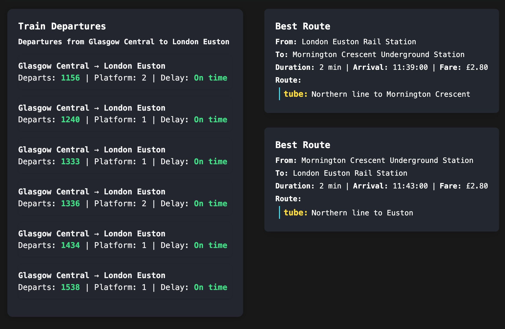

# Travel Dashboard

THIS PROJECT IS UNDER VERY HEAVY DEVELOPMENT!




A full-stack application for live train and tube status, route planning, and departures, built with Next.js (frontend) and FastAPI (backend).


## Overview

**Frontend (app/):** Next.js, React, Tailwind CSS. Responsive dashboard UI for train departures, tube line status, and best route suggestions. Fetches live data from the FastAPI backend.

**Backend (api/):** FastAPI (Python). Modular endpoints for train departures, tube line status, best route. Integrates with Real Time Trains and TFL APIs. Returns simplified, frontend-friendly JSON responses.

## Features

- Live train departures and delays
- Tube line status updates
- Best route suggestions using TFL Journey Planner
- Config endpoint for frontend settings
- Responsive, retro-inspired UI
- Multi-arch Docker builds and CI/CD via GitHub Actions

## Project Structure

```
train_dashboard/
├── app/         # Next.js frontend
├── api/         # FastAPI backend
├── .github/     # CI/CD workflows
├── docker-compose.yaml
├── README.md    # Project documentation
```


## Configuration: Mounting config.json

The backend API stores its settings in a config file (`config.json`). When running with Docker Compose, you can mount a host directory to persist and edit this file outside the container. This is configured in `docker-compose.yaml`:

```yaml
  api:
    volumes:
      - ./config:/app/config:rw
```

**How it works:**
- The local `./config` directory is mounted to `/app/config` inside the container.
- Any changes made by the backend to `/app/config/config.json` will be reflected in your local `./config/config.json` file.
- You can edit or back up `config.json` directly on your host machine.

**Usage notes:**
- If `config.json` does not exist in `./config`, the backend will create it when needed.
- Ensure your local directory and file have write permissions for the container user.
- If you switch back to a named volume (e.g., `config_data:/app/config`), Docker will use its own internal storage and changes will not be reflected on the host.

### Docker Images

Pre-built docker images for both the API and app are available at:

- `henrypenton/train-dashboard-api`
- `henrypenton/train-dashboard-app`

### Configuration File (`api/config.json`)

This file contains route and departure configuration for the train dashboard.

**Example Structure:**

```json
{
  "tfl_best_routes": [
    {
      "origin": "<Origin Station Name>",
      "originNaPTANOrATCO": "<Origin NaPTAN or ATCO Code>",
      "destination": "<Destination Station Name>",
      "destinationNaPTANOrATCO": "<Destination NaPTAN or ATCO Code>"
    }
    // ... more routes
  ],
  "rail_departures": [
    {
      "origin": "<Origin Station Name>",
      "originCode": "<Origin Station Code>",
      "destination": "<Destination Station Name>",
      "destinationCode": "<Destination Station Code>"
    }
    // ... more departures
  ],
  "show_tfl_lines": true
}
```

**Field Descriptions:**

_tfl_best_routes_

- `origin`: Name of the origin station
- `originNaPTANOrATCO`: NaPTAN or ATCO code for the origin station
- `destination`: Name of the destination station
- `destinationNaPTANOrATCO`: NaPTAN or ATCO code for the destination station

_rail_departures_

Codes for stations can be either **CRS** codes (e.g. PAD for London Paddington) or **TIPLOC** codes (PADTON). For Paddington, the **CRS** code includes Crossrail and GWR trains.

- `origin`: Name of the origin station
- `originCode`: Station code for the origin station
- `destination`: Name of the destination station
- `destinationCode`: Station code for the destination station

### Real Time Trains API Credentials

To use live train departures, obtain an API username and password from Real Time Trains (RTT): https://www.realtimetrains.co.uk/about/developer
Add your credentials to `.env` as `RTT_API_USER` and `RTT_API_PASS`. See `.env.template` for an example.

### Config File Use

Mount the config file as a volume, as shown in the example `docker-compose.yaml`.

## Development - Getting Started

1. **Clone the repository:**

```sh
git clone https://github.com/HenryPenton/train_dashboard.git
cd train_dashboard
```

2. **Manual Development:**

- Frontend: `cd app && pnpm install && pnpm dev`
- Backend:

```sh
cd api
python3.14 -m venv venv
source venv/bin/activate
pip install -r requirements.txt
fastapi dev src/main.py
```

3. **Usage:**

- Frontend: http://localhost:3000
- Backend: http://localhost:8000

## API Endpoints

- `/rail/departures/{origin_station_code}/to/{destination_station_code}`: Get train departures between two stations
- `/tfl/line-status`: Get tube line status
- `/tfl/best-route/{from_station}/{to_station}`: Get best route
- `/config`: Get config JSON

## Frontend Routes

- `/`: Main dashboard
- `/api/*`: Next.js API routes (proxy to backend)

## CI/CD

- Multi-arch Docker builds for both frontend and backend
- Automated builds and pushes via GitHub Actions

## Running Unit Tests

### Backend (FastAPI/Python)

Unit tests for the backend are written using `pytest`.

To run all backend tests:

```sh
cd api
pytest
```

You can run a specific test file:

```sh
pytest src/test/domain/rail/departures/departure_parts/test_departure_times.py
```

### Frontend (Next.js/React)

Unit tests for the frontend are written using Jest and React Testing Library.

To run all frontend tests:

```sh
cd app
pnpm test
```

You can run a specific test file:

```sh
pnpm test app/components/__tests__/TflBestRoute.test.tsx
```

Test coverage reports and watch mode are also available via Jest CLI options.

## License

MIT
